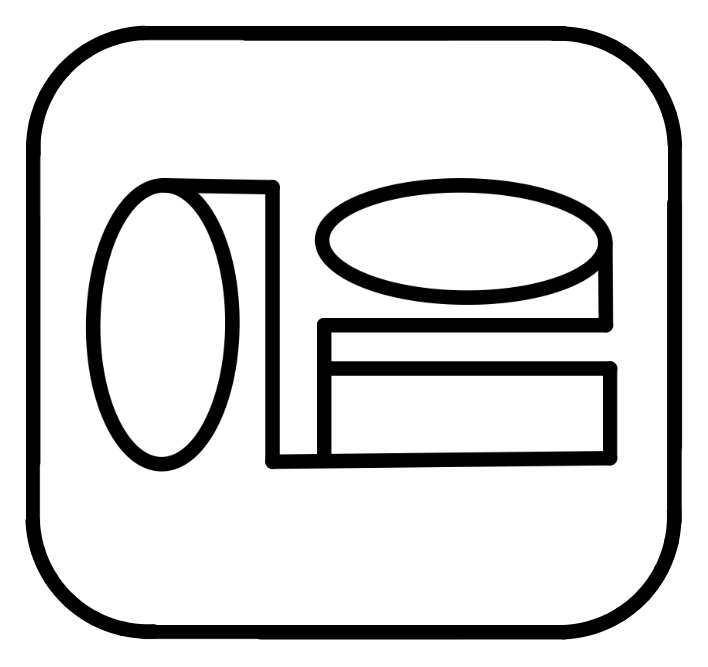
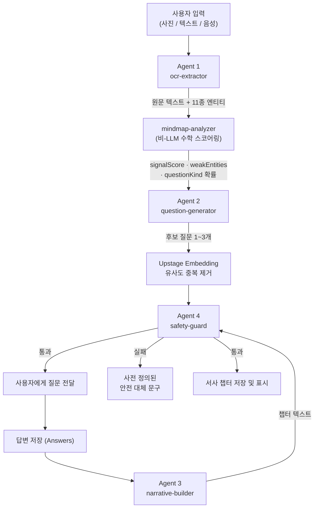

<p align="center">
  
</p>

# 이음 (EEUM)

**세대 간 연결 회상 및 기억 건강 플랫폼**

어르신의 오래된 손글씨 일기, 편지, 빛바랜 사진을 AI가 다정한 질문으로 되살리고, 그 답변을 자녀(보호자)의 기억과 하나의 서사로 엮어주는 비약물적 인지 자극 서비스입니다.

<p align="center">
  <a href="https://nextjs.org"></a>
  <a href="https://react.dev"></a>
  <a href="https://www.typescriptlang.org"></a>
  <a href="https://tailwindcss.com"></a>
</p>
<p align="center">
  <a href="https://supabase.com"></a>
  <a href="https://www.upstage.ai"></a>
  <a href="https://ai.google.dev"></a>
  <a href="https://web.dev/progressive-web-apps"></a>
</p>

> 본 서비스는 비약물적 회상 인지 자극을 목적으로 설계되었으며, 정신과적·의학적 진단이나 임상 진료를 대체하지 않습니다. 이 원칙은 서비스 UX뿐 아니라 AI 프롬프트 설계와 안전 검수 로직 전체를 관통하는 핵심 제약 조건입니다.

---

## 목차

1. [프로젝트 개요](#프로젝트-개요)
2. [핵심 기능](#핵심-기능)
3. [기술 스택](#기술-스택)
4. [AI 사용 방식 및 에이전트 구조 (제품 내부 파이프라인)](#ai-사용-방식-및-에이전트-구조-제품-내부-파이프라인)
5. [개발 과정에서의 AI 활용 (IDE 에이전트 구성)](#개발-과정에서의-ai-활용-ide-에이전트-구성)
6. [API 엔드포인트](#api-엔드포인트)
7. [데이터베이스 구조](#데이터베이스-구조)
8. [프로젝트 구조](#프로젝트-구조)
9. [화면 구성 (라우트 맵)](#화면-구성-라우트-맵)
10. [접근성 및 UX 설계 원칙](#접근성-및-ux-설계-원칙)
11. [시작하기](#시작하기)

> 이 문서는 AI 활용을 두 층위로 나누어 서술합니다 — **(1) 제품이 사용자에게 제공하는 AI 파이프라인**과 **(2) 이 제품을 만드는 개발 과정에서 사용한 AI 협업 체계**는 서로 다른 것이므로 섹션을 명확히 분리했습니다.

---

## 프로젝트 개요

### 문제 의식

고령층의 기억 건강 관리는 대부분 병원 중심의 사후 대응(진단·투약)에 머물러 있고, 일상 속에서 꾸준히 실천할 수 있는 비약물적 인지 자극 수단은 부족합니다. 동시에 자녀 세대는 부모님의 지나온 삶을 온전히 알지 못한 채 시간이 흐르고, 부모님 역시 자녀가 잘 모르는 자신만의 소중한 기억을 홀로 간직한 채 살아갑니다.

**이음**은 이 두 가지 문제를 하나의 흐름으로 연결합니다.

1. **회상 치료(Reminiscence Therapy) 기법**을 디지털로 구현해 어르신이 매일 짧은 질문에 답하며 자연스럽게 과거를 회상하도록 돕고,
2. 그 회상을 **자녀와 병기(竝記)**하여 세대 간 기억의 간극을 좁히는 대화의 통로로 만듭니다.

### 핵심 컨셉 — "나이테 회상"

이음은 어르신의 삶을 선형적인 연표가 아니라 **나무의 나이테처럼 겹겹이 쌓인 기억의 동심원**으로 다룹니다. 이를 위해 모든 회상 데이터는 3가지 **MemoryZone**(기억 영역)으로 구분되어 서로 다른 질문 전략과 공유 정책을 갖습니다.

| MemoryZone | 의미 | 질문 전략 | 공유 여부 |
| :--- | :--- | :--- | :--- |
| `sharedIndependentMemory` | 부모·자녀가 함께 겪은 핵심 공통 기억 (입학식, 소풍, 가족 행사 등) | 양쪽 모두에게 열린 회상 질문 발송 | 공유 (병기) |
| `inheritedStory` | 자녀 유아기의, 자녀 본인은 기억하지 못하는 시절 | 부모에게는 솔직한 회상, 자녀에게는 "들어본 적 있는 이야기" 반응 유도 | 공유 (병기) |
| `soloPatientOnly` | 자녀 출생 이전, 부모님만의 단독 인생 | 자녀에게 절대 동시 발송하지 않는 단독 질문 | 비공유 (추후 "자녀가 모르는 이야기" 챕터로 재구성) |

이 3단 구조는 질문 생성(Agent 2)과 서사 재구성(Agent 3) 양쪽 모두에서 프롬프트 분기 조건으로 사용되며, `/narrative` 뷰어의 3단 카테고리 분류에도 그대로 이어집니다.

### 대상 사용자

- **어르신 (`self`)**: 매일 도착하는 회상 질문에 텍스트/음성/사진(OCR)으로 답하고, 일상 일기를 남깁니다.
- **보호자 (`guardian`)**: 어르신의 답변을 함께 열람하고, 같은 질문에 자신의 기억을 병기하며, 옛 사진이나 힌트를 근거로 새로운 대화 주제를 직접 제안할 수 있습니다.

한 브라우저 세션 안에서 우측 상단의 역할 전환 버튼으로 두 역할을 오가며 실제 가족 간 상호작용을 시뮬레이션할 수 있습니다 (데모/평가 편의를 위한 구조이며, 상세는 [시작하기](#시작하기) 참고).

---

## 핵심 기능

- **AI 회상 질문 생성**: 매일 자동으로 새로운 개방형 회상 질문을 생성하고, MemoryZone에 따라 공유/비공유를 분기합니다.
- **손글씨/편지 OCR 디지털화**: 옛 일기장이나 편지 사진을 업로드하면 텍스트로 변환하고, 11종 엔티티(인물·장소·시간·사건 등)를 자동 태깅합니다.
- **3가지 답변 방식**: 키보드 입력, 음성 인식(Web Speech API), 사진 업로드(OCR) 중 편한 방식을 선택할 수 있습니다.
- **보호자 대화 주제 제안**: 보호자가 옛 사진·키워드·음성 힌트를 올리면 AI가 기계적 템플릿이 아닌 맥락을 이해한 자연스러운 질문 한 문장으로 재구성합니다.
- **세대 간 서사 재구성**: 답변들을 연도별로 클러스터링하여 챕터 제목과 수필형 문단으로 재구성하고, 부모·자녀의 답변을 나란히 병기합니다.
- **11-카테고리 추억 보관함** (`/narrative`): 인물·장소·시간·행사·동물 등 카테고리 → 세부 태그(등장 빈도순) → 추억 카드의 3단 필터 구조로 자신의 기억을 탐색합니다.
- **추억 사진첩** (`/album`): OCR 스캔본과 답변에 첨부된 사진을 한 곳에 모아 보고, 클릭 시 원본 크기로 확대해 볼 수 있습니다.
- **활동 캘린더**: 월별 캘린더에서 회상/일기 작성 여부와 연속 기록(streak)을 한눈에 확인합니다.
- **접근성 설정**: 글자 크기 4단계, 색각 이상 보정(적록색약·청황색약) 및 고대비 모드를 지원합니다.
- **다크/라이트 모드**: 시간대 기반 자동 전환과 수동 토글을 모두 지원하며, PWA 상태바 색상까지 동기화됩니다.
- **PWA 지원**: `manifest.json` + 서비스워커(`sw.js`)로 홈 화면 설치 및 오프라인 셸 캐싱을 지원합니다.

---

## 기술 스택

<p align="center">
  
  
  
  
  <br/>
  
  
  
  
  
  
</p>

| 영역 | 기술 |
| :--- | :--- |
| 프레임워크 | Next.js 16 (App Router, Turbopack, React Server Components) |
| 언어 | TypeScript, React 19 |
| 스타일링 | Tailwind CSS 4 (CSS 변수 기반 커스텀 디자인 토큰), 커스텀 라이트/다크/고대비/색각보정 테마 |
| 데이터베이스 | Supabase (PostgreSQL) — 환경변수 미설정 시 **localStorage 기반 목업 DB로 자동 폴백** |
| LLM (텍스트 생성) | **Upstage Solar Pro** (Chat Completions, JSON 모드) |
| OCR / 문서 파싱 | **Upstage Document Parse / Document AI OCR** |
| 임베딩 / 유사도 검색 | **Upstage Solar Embedding** (`solar-embedding-1-large-*`) + 코사인 유사도 자체 구현 |
| 예비 LLM 통합 | Google Gemini (`@google/generative-ai`, `gemini-2.0-flash`) — SDK 연동 완료, 현재 파이프라인은 Upstage로 통일 운영 |
| 음성 인식 | Web Speech API (`SpeechRecognition` / `webkitSpeechRecognition`) |
| 애니메이션 | anime.js, Lottie |
| PWA | Web App Manifest + Service Worker |

---

## AI 사용 방식 및 에이전트 구조 (제품 내부 파이프라인)

이음의 AI 파이프라인은 **하나의 거대한 프롬프트가 아니라, 각자 단일 책임을 갖는 4개의 에이전트가 순차 협업하는 구조**로 설계되어 있습니다. 각 에이전트는 `lib/agents/`에 독립 모듈로 존재하며, API 라우트가 이들을 정해진 순서로 호출하는 오케스트레이터 역할을 합니다.



### 설계 철학: "무엇을 물을지는 알고리즘이, 어떻게 물을지는 LLM이"

질문의 **주제 선택**(어떤 엔티티를 파고들지, 오늘은 일기 연계형인지 원본 회상형인지)은 결정론적 수학 공식으로 계산하고, 그 주제를 **따뜻한 문장으로 표현하는 것**만 LLM에 맡깁니다. 이렇게 LLM 호출 범위를 좁히면 (1) 같은 입력에 대해 재현 가능한 우선순위를 유지할 수 있고 (2) 프롬프트가 "무엇을 물을지"까지 매번 새로 판단할 필요가 없어 응답 품질이 안정적입니다.

#### 비-LLM 분석 엔진 — `lib/analytics/mindmap-analyzer.ts`

- **`signalScore` 공식**: `연결도(degree) × 0.4 + 엔티티 유형 다양성(diversity) × 0.3 + 최신성(recency, 로그 감쇠) × 0.2 + (1/언급빈도) × 0.1`. 여러 답변에 걸쳐 다양한 맥락과 함께 등장하는 엔티티일수록, 그리고 최근에 언급되었을수록 "더 캐물어볼 가치가 있는" 기억으로 판단합니다.
- **약한 엔티티(weak entity) 탐지**: 연결도 1 이하이거나 7일 이상 언급되지 않은 엔티티를 추적하고, **15%의 통제된 확률**로 최상위 인기 엔티티 대신 이 "잊혀가는 기억"을 질문 대상으로 끼워 넣습니다 (`selectTargetEntities`). 항상 가장 뻔한 화제만 반복하지 않도록 하는 장치입니다.
- **일기 연계 확률(`P_DiaryBased`) 공식**: `Clamp(0.2, 0.8, 0.25 + 0.15 × 최근7일_일기수 − 0.04 × 마지막_일기_이후_경과일 + 0.1 × 최상위_signalScore)`. 이 값과 난수를 비교해 오늘의 질문을 "최근 일상 일기와 연계된 회상"으로 할지 "순수 원본 회상"으로 할지 결정합니다.

이 두 계산은 순수 함수로, 어떤 외부 API 호출도 없이 즉시 실행됩니다.

#### Agent 1 — `ocr-extractor` (`lib/agents/ocr-extractor-agent.ts`)

- **역할**: 이미지/텍스트 → 원문 텍스트 + 구조화된 엔티티
- **사용 기술**: Upstage Document Parse API (`document-digitization`)로 손글씨/인쇄물 이미지를 텍스트화하고, 실패 시 Document AI OCR 엔드포인트로 폴백합니다.
- **신뢰도 게이트**: Document Parse 신뢰도가 0.6 미만이면 엔티티 추출을 건너뛰고 `needsRecapture: true`를 반환 — 클라이언트는 이 플래그로 "다시 촬영해주세요" UX를 띄웁니다.
- **11종 엔티티 추출** (`services/upstage-service.ts::extractInformation`): person·place·object·time_period·food·occasion·activity·sensory·animal·emotion·event 11개 카테고리를, 정규식(연도·계절 패턴)과 도메인 키워드 사전을 결합한 규칙 기반 태거로 추출합니다. 1~2글자 키워드는 단어 경계(lookbehind/lookahead 정규식)를 강제해 오탐을 줄였습니다.
- 이 에이전트는 이미지 OCR뿐 아니라, 답변 텍스트 자체에서도 엔티티를 다시 추출(`extractFromAnswers`)해 `/narrative`·`/api/mindmap`의 카테고리 분류와 시그널 스코어링의 입력으로 재사용됩니다.

#### Agent 2 — `question-generator` (`lib/agents/question-generator-agent.ts`)

- **역할**: 엔티티 + 과거 이력 + MemoryZone → 안전한 개방형 회상 질문
- **모델**: Upstage Solar Pro (`temperature: 0.4`, JSON 모드)
- **절대 원칙을 시스템 프롬프트에 명문화**: 의료적 진단 언급 금지, 조언/지시 금지, 정답·오답 판정 금지, 항상 개방형 질문으로 종결, 사실 왜곡 금지, 과거 질문과 주제 중복 금지 — 이 6개 원칙은 매 호출마다 프롬프트 최상단에 고정 삽입됩니다.
- **MemoryZone 3단 분기**: 같은 함수 안에서 zone 값에 따라 프롬프트 가이드 문구 자체를 교체합니다 (공통 기억 / 전해들은 이야기 / 부모 단독 인생).
- **QuestionKind 분기**: `mindmap-analyzer`가 계산한 확률로 결정된 `personal_reminiscence`(원본 회상) 또는 `recent_diary_recall`(최근 일기 연계) 지침을 프롬프트에 삽입합니다.
- **Plan C — 확장 히스토리 윈도우**: 최근 답변 15개를 프롬프트에 통째로 넣어 "이미 물어본 주제"를 LLM이 스스로 인지하고 피하도록 합니다.
- **Plan A — 임베딩 기반 의미적 중복 제거**: LLM이 생성한 후보 질문마다 Upstage Solar Embedding으로 벡터화한 뒤, 과거 질문들의 임베딩과 코사인 유사도를 계산합니다. **유사도 0.82 이상이면 표현이 달라도 같은 주제로 판단해 후보에서 제외**합니다. 단순 문자열 비교로는 잡아낼 수 없는 "다른 말로 같은 걸 또 물어보는" 문제를 벡터 유사도로 해결한 부분입니다.
- **`generateCustomTopicQuestion`**: 보호자/어르신이 입력한 자유 텍스트나 사진 OCR 결과를 받아, `"키워드 + 템플릿 문장"` 식의 기계적 결합을 명시적으로 금지하고 문맥 전체를 이해한 자연스러운 질문 1문장으로 재작성하도록 지시합니다. (예: "아버지의 롤 승률 44.68%" → "아버님께서 즐겨 하시던 게임의 승률 기록을 보니 남다른 열정이 느껴지네요. 그 시절 이야기가 있으신가요?")
- **`generateDynamicDailyDiaryPrompt`**: 최근 답변·일기 맥락(최대 150자)을 반영해 오늘의 일상 일기 유도 질문을 매번 새로 생성합니다 (`temperature: 0.7`로 더 다양한 표현 유도).
- **장애 허용 설계**: API 키가 없거나 호출이 실패하면 MemoryZone별로 준비된 폴백 질문 뱅크에서 과거 이력과 중복되지 않는 문항을 즉시 반환합니다 — 어떤 이유로도 사용자가 빈 화면을 보지 않습니다.

#### Agent 3 — `narrative-builder` (`lib/agents/narrative-builder-agent.ts`)

연도별 답변 그룹마다 **4단계 릴레이**로 서사 챕터를 조립합니다.

1. **연대기 정렬** (코드 로직): `event_date` 기준으로 답변을 정렬하고 연도별로 그룹화합니다.
2. **클러스터링** (Solar Pro, `temperature: 0.3`): 그룹 내 모든 답변을 요약해 10자 이내의 짧은 챕터 제목을 생성합니다.
3. **자연어 재구성** (Solar Pro, `temperature: 0.7`): 여러 문답을 어르신의 어투를 존중한 2~3문장의 수필형 문단으로 매끄럽게 이어 붙입니다.
4. **병기 및 MemoryZone 챕터 태깅** (코드 로직): 같은 질문에 대한 어르신·보호자 답변을 `MergedPerspective` 구조로 나란히 묶고, 지배적인 MemoryZone에 따라 챕터를 `shared`(세대 연결) / `inherited`(전해들은 이야기) / `solo_hidden_gem`(자녀가 모르는 이야기)로 분류합니다.

같은 생성 온도(temperature)를 단계별로 다르게 준 것이 특징입니다 — 제목은 일관성이 중요해 0.3(낮게), 문단은 표현의 풍부함이 중요해 0.7(높게)로 나누어 호출합니다.

#### Agent 4 — `safety-guard` (`lib/agents/safety-guard-agent.ts`)

- **역할**: 모든 AI 생성 텍스트(질문, 서사)가 사용자에게 도달하기 전 통과해야 하는 **필수 최종 게이트**
- **모델**: Upstage Solar Pro (`temperature: 0.1`, 결정론적 응답을 위한 저온 설정)
- **4가지 검수 항목**: ① 의료적/정신과적 진단 표현("치매", "인지장애" 등) ② 조언·지시·처방성 표현 ③ 정답/오답 판정·점수·비교 표현 ④ 사실 왜곡 표현
- **호출 지점**: `/api/questions`(생성된 질문마다 개별 검수), `/api/questions/custom`(보호자 제안 질문), `/api/narrative`(재구성된 전체 서사 텍스트)
- **이중 방어(defense in depth)**: LLM 호출 자체가 실패하는 경우를 대비해 키워드 매칭 기반의 로컬 폴백 검수 로직도 함께 갖추고 있어, 외부 API 장애 상황에서도 검수 없이 텍스트가 통과되는 일이 없도록 설계했습니다.
- 검수에 실패한 질문은 로그로 위반 사유를 남기고, 사전에 준비된 안전한 대체 문구로 조용히 치환되어 사용자 경험이 끊기지 않습니다.

#### Gemini SDK 통합 현황

`@google/generative-ai`와 `services/gemini-service.ts`(구조화 JSON 생성 `generateJSON`, 일반 텍스트 생성 `generateText`, `responseSchema` 기반 구조화 출력 지원)가 프로젝트에 포함되어 있습니다. 현재 라이브 파이프라인은 4개 에이전트 모두 Upstage Solar로 통일해 운영 중이며, Gemini 서비스는 향후 멀티 LLM 라우팅이나 폴백 다양화를 위한 **연동 준비가 끝난 예비 모듈**로 존재합니다.

#### 모든 외부 AI 호출의 장애 허용 원칙

Upstage API 키가 없거나 호출이 실패해도 앱 전체가 동작하도록, 모든 서비스 레이어(`solar-service.ts`, `upstage-service.ts`)에 **하드코딩된 폴백**이 준비되어 있습니다 — 목업 OCR 텍스트, MemoryZone별 질문 뱅크, 키워드 기반 안전검수. 이 덕분에 API 키 없이도 앱의 전체 사용자 흐름을 처음부터 끝까지 시연할 수 있습니다.

---

## 개발 과정에서의 AI 활용 (IDE 에이전트 구성)

위 섹션이 "이음이 사용자에게 제공하는 AI 기능"이라면, 이 섹션은 **"이음을 만들 때 개발자가 실제로 사용한 AI 협업 체계"**입니다. 이음은 단일 채팅창에 코드를 맡기는 방식이 아니라, IDE 레벨에서 **목적별 서브에이전트·자가 갱신되는 skill·세션 영속화**를 구성해 개발했습니다. 이 구성 자체가 저장소에 `.agent/`, `.agents/`, `docs/sessions/`, `aiUsageLog.md`로 그대로 남아있어 재현·검증이 가능합니다.

### 에이전트 구성

- **프로젝트 전용 규칙 문서** (`AGENTS.md`, `.agents/rules/project-overview.md`): 어떤 AI 도구/세션이 붙어도 동일한 규칙을 자동으로 상속하도록, 4-에이전트 아키텍처 스펙·안전 원칙(진단 금지·정답 판정 금지 등)·네이밍 컨벤션·UI 흐름 원칙·커밋 컨벤션을 프로젝트 루트에 명문화했습니다. 이 문서에 적힌 "정확히 4개, 늘리지 않음"이라는 4-에이전트 스펙은 실제 `lib/agents/` 구현과 1:1로 일치합니다 — 규칙 문서가 사후 정당화가 아니라 개발을 실제로 구속했다는 뜻입니다.
- **목적별 서브에이전트 위임**: `planner`(복잡한 기능 설계), `code-reviewer`(코드 작성 직후 자동 리뷰), `security-reviewer`(보안 민감 코드), `build-error-resolver`(빌드 실패), `react-reviewer`/`typescript-reviewer`(스택 특화 리뷰) 등 목적이 분리된 서브에이전트로 작업을 위임하는 구조를 사용했습니다 — 기능 구현과 그 코드에 대한 검토를 같은 에이전트가 맡지 않도록 분리한 것이 핵심입니다.
- **안전 규칙의 코드 반영 확인**: `project-overview.md` 7절 "AI 행동 규칙"에 적힌 안전검수 4항목(진단성/조언성/판정성/왜곡 표현 금지)은 `lib/agents/safety-guard-agent.ts`의 실제 체크리스트와 동일합니다 — 규칙 문서와 구현이 어긋나지 않도록 관리되었습니다.

### Skill 자동 업데이트

정적인 프롬프트 모음이 아니라 **실사용 결과를 반영해 스스로 갱신되는 skill 체계**를 사용했습니다.

- `git` 커밋 히스토리에서 반복되는 패턴(커밋 컨벤션, 함께 바뀌는 파일, 워크플로우 시퀀스)을 분석해 재사용 가능한 `SKILL.md`를 자동 생성하는 워크플로우를 사용합니다. 예를 들어 개발 중 "답변을 수정할 때마다 LLM 파이프라인이 불필요하게 재호출되는" 문제를 겪은 뒤, 이를 그때그때 임시로 고치는 대신 `.agents/skills/llm-edit-cooldown/SKILL.md`라는 **프로젝트 전용 skill**로 고정했습니다. (localStorage 기반 3분 쿨다운, 수정 시 입력수단 재선택 생략, `isEdit` 플래그로 서사 노드 중복 방지 — 이 skill 하나가 이후 모든 "기존 기록 수정" 플로우에 일관되게 재사용됩니다.)
- skill별 성공률 추이·실패 패턴 클러스터링·"보류 중인 수정 제안(pending amendment)"을 추적하는 대시보드 워크플로우가 함께 있어, 한 번 만든 skill이 고정되지 않고 실사용 실패가 누적되면 개선 제안이 자동으로 올라오는 피드백 루프를 갖춥니다.

### Session 저장 및 재개

멀티세션 개발에서 컨텍스트가 끊기지 않도록 세션 상태를 **두 층위**로 남겼습니다.

- **작업 재개용 로컬 스냅샷**: 세션 종료 시 "무엇이 작동했는지(근거 포함) / 무엇이 실패했는지와 정확한 사유 / 아직 안 해본 것 / 다음에 할 정확한 한 걸음"을 구조화해 저장하고, 다음 세션 시작 시 그대로 불러와 이어갑니다. 특히 "무엇이 실패했는지"를 필수 기록해 다음 세션이 이미 실패한 접근을 맹목적으로 재시도하지 않게 합니다.
- **저장소에 커밋되는 세션 로그** (`docs/sessions/`): 날짜별 세션 요약을 저장소 히스토리에 영구 보존합니다. 예) [`2026-08-02-eeum-refactor-session.md`](docs/sessions/2026-08-02-eeum-refactor-session.md) — D3 마인드맵 UI 폐지 및 `mindmap-analyzer.ts` 벡터 거리 엔진 보존, 11-카테고리 답변 카드 뷰어 전환, 역할별(어르신/보호자) 홈 UI 분기, 세션 스위칭 버그 수정까지 "무엇을 시도했고 무엇이 실패했는지"를 그대로 남긴 기록입니다.
- **AI 활용 감사 로그** ([`aiUsageLog.md`](aiUsageLog.md)): 모든 AI 보조 변경을 `날짜 / 작업 / AI 도구 / 사용 에이전트(Planner·Coder 등) / 목적 / 결과 / 변경 파일` 형식으로 기록합니다. 커밋 메시지에도 `(drafted with Antigravity)`처럼 사용한 AI 도구를 명시해, 어떤 코드가 어떤 AI 세션에서 왜 만들어졌는지 항상 역추적할 수 있습니다.

### 차별점 요약

| 흔한 "AI로 코딩함" | 이음의 개발 접근 |
| :--- | :--- |
| 하나의 대화창에 전부 맡김 | planner/reviewer/security 등 목적별 서브에이전트로 위임 |
| 프롬프트를 매번 새로 작성 | git 히스토리에서 패턴을 추출해 프로젝트 skill로 고정, 실패 시 개선 제안 자동 추적 |
| 세션이 끝나면 맥락이 증발 | 로컬 재개용 스냅샷 + 저장소 커밋 세션 로그(`docs/sessions/`)로 이중 보존 |
| AI가 뭘 얼마나 했는지 불투명 | 커밋 메시지 태깅 + `aiUsageLog.md` 감사 로그로 전부 추적 가능 |
| 프로젝트 규칙이 개발자 기억에만 의존 | `.agents/rules/project-overview.md`에 아키텍처·안전 원칙·UI 규칙을 명문화해 모든 세션이 동일 규칙을 자동 상속 |

---

## API 엔드포인트

모든 엔드포인트는 Next.js Route Handler(`app/api/**/route.ts`)로 구현되어 있으며, 응답은 `{ success: true, ... }` 또는 `{ error: string }` 형태를 따릅니다.

### `POST /api/ocr`

이미지 또는 텍스트를 받아 Agent 1(ocr-extractor)만 단독 실행합니다. `/journal`(직접 답변 작성 중 사진 첨부)과 `/custom-topic`에서 사용됩니다.

- **요청**: `multipart/form-data` (`file`: 이미지) 또는 `application/json` (`{ text: string }`)
- **응답**: `{ success: true, data: { text, entities, confidence, needsRecapture } }`

### `POST /api/questions`

오늘의 회상 질문을 생성하는 메인 엔드포인트. `/home`에서 오늘 날짜에 해당하는 질문이 없을 때 자동 호출됩니다.

- **요청 바디**: `{ userId: string, isShared?: boolean, memoryZone?: MemoryZone }`
- **처리 흐름**: 답변/일기 조회 → Agent 1로 엔티티 재추출 → `mindmap-analyzer`로 시그널 스코어·타깃 엔티티·질문 유형 확률 계산 → Agent 2 호출 → 생성된 질문마다 Agent 4 개별 검수 → 통과한 질문만 반환 (실패 시 안전 대체 문구로 치환)
- **응답**: `{ success: true, questions: string[], memoryZone, shared, questionKind, pDiaryBased }`

### `POST /api/questions/custom`

보호자(또는 어르신)가 힌트·사진으로 새 대화 주제를 제안할 때 사용합니다. `/custom-topic`에서 호출됩니다.

- **요청**: `multipart/form-data` (`userId`, `textHint`, `creatorRole`, `file?`) 또는 JSON 동급 필드
- **처리 흐름**: 이미지가 있으면 Upstage Document Parse + Agent 1으로 텍스트/엔티티 추출 → Agent 2의 `generateCustomTopicQuestion` 호출 → Agent 4 검수 → 사진이 첨부된 경우 사진 맥락을 어르신 답변(`answers`)으로 자동 선기록 → 질문을 `questions_history`에 저장
- **응답**: `{ success: true, qid, qtext, shared, creatorRole, photoContextRecorded }`

### `POST /api/narrative`

특정 사용자의 전체 답변을 서사 챕터로 재구성합니다. `/narrative` 진입 시 및 서사 갱신 트리거 시 호출됩니다.

- **요청 바디**: `{ userId: string }`
- **처리 흐름**: 답변 전체 조회 → Agent 3의 4단계 릴레이 실행 → 결과 전체 텍스트에 대해 Agent 4 검수(현재 결과는 로깅되며, 위반 시에도 서사는 반환됨 — 상세는 서비스 로그 참고) → Agent 1로 엔티티 재추출 후 `mindmap-analyzer`로 분석 지표 계산
- **응답**: `{ success: true, narratives: DBNarrative[], fullNarrativeText, safetyCheck, analytics: { weakEntities, nodeSizes, suggestedSharedFrequency } }`

### `GET /api/mindmap?userId=...`

저장된 서사와 답변을 바탕으로 마인드맵 분석 지표만 조회합니다.

- **쿼리 파라미터**: `userId` (기본값 `user-elderly-123`)
- **처리 흐름**: 서사·답변 조회 → Agent 1로 엔티티 재추출 → `mindmap-analyzer` 실행
- **응답**: `{ success: true, narratives, analytics: { weakEntities, nodeSizes, suggestedSharedFrequency, scoredEntities } }`

---

## 데이터베이스 구조

Supabase(PostgreSQL) 기반이며, 핵심 5개 테이블의 전체 ERD와 DDL 스크립트는 [`docs/database-schema.md`](docs/database-schema.md)에 정리되어 있습니다.

| 테이블 | 역할 |
| :--- | :--- |
| `users` | 사용자 계정, 역할(self/guardian), 접근성 설정 |
| `questions_history` | 발송된 회상 질문 이력 및 MemoryZone·공유 여부 |
| `answers` | 어르신/보호자의 답변 (텍스트·이미지·음성 URL, 비공개 여부) |
| `narratives` | Agent 3가 재구성한 서사 챕터 (병기 답변 JSON 포함) |
| `daily_diaries` | 일상 일기 |
| `custom_proposed_questions`* | 보호자/어르신이 제안한 커스텀 대화 주제 |
| `voice_journals` / `ocr_scans` / `family_invites` / `safety_logs` / `notifications` | Tier 2~3 확장 예정 테이블 (스키마 문서에 DDL 정의만 존재, 미연동) |

\* `custom_proposed_questions`는 `services/supabase-service.ts`에서 실제로 읽고 쓰는 테이블이지만 스키마 문서(DDL)에는 아직 반영되어 있지 않습니다 — Supabase 연동 모드로 배포하기 전 `docs/database-schema.md`에 DDL을 추가해야 합니다.

### 목업 모드 (Mock Mode)

`services/supabase-service.ts`는 `NEXT_PUBLIC_SUPABASE_URL` / `NEXT_PUBLIC_SUPABASE_ANON_KEY` 환경변수가 없거나 유효하지 않으면 **자동으로 목업 모드**로 전환되어, 동일한 인터페이스로 브라우저 `localStorage`(서버 사이드에서는 인메모리 Map)에 데이터를 저장합니다. 실제 Supabase 프로젝트 없이도 회원가입부터 질문 생성, 서사 재구성까지 전체 플로우를 즉시 체험할 수 있으며, 초기 실행 시 어르신/보호자 데모 계정과 샘플 질문이 자동 시딩됩니다.

---

## 프로젝트 구조

```
EEUM/
├── app/
│   ├── page.tsx                 # 랜딩 페이지
│   ├── register/page.tsx        # 로그인/회원가입 위저드
│   ├── home/page.tsx            # 메인 대시보드 (역할별 분기)
│   ├── journal/                 # 오늘의 질문 답변 작성 (+완료 화면)
│   ├── daily-diary/page.tsx     # 일상 일기
│   ├── custom-topic/page.tsx    # 보호자 대화 주제 제안
│   ├── narrative/                # 11-카테고리 추억 뷰어 (Server+Client 컴포넌트)
│   ├── album/                   # 추억 사진첩
│   └── api/
│       ├── ocr/route.ts
│       ├── questions/route.ts
│       ├── questions/custom/route.ts
│       ├── narrative/route.ts
│       └── mindmap/route.ts
├── lib/
│   ├── agents/                  # 4개 AI 에이전트
│   │   ├── ocr-extractor-agent.ts        (Agent 1)
│   │   ├── question-generator-agent.ts   (Agent 2)
│   │   ├── narrative-builder-agent.ts    (Agent 3)
│   │   └── safety-guard-agent.ts         (Agent 4)
│   └── analytics/
│       └── mindmap-analyzer.ts  # 비-LLM 시그널 스코어링 / 확률 엔진
├── services/
│   ├── solar-service.ts         # Upstage Solar Pro Chat Completions
│   ├── upstage-service.ts       # Document Parse / OCR / IE / Embedding
│   ├── gemini-service.ts        # Google Gemini SDK (예비 통합)
│   └── supabase-service.ts      # DB 접근 계층 (Supabase ↔ localStorage 목업 자동 전환)
├── components/                  # 공용 UI 컴포넌트
├── docs/
│   ├── database-schema.md       # 전체 ERD 및 DDL
│   └── sessions/                # 개발 세션 로그
└── public/                      # 정적 자산, PWA 매니페스트/서비스워커
```

---

## 화면 구성 (라우트 맵)

| 경로 | 설명 |
| :--- | :--- |
| `/` | 랜딩 페이지 — 서비스 소개 및 데모 시작 |
| `/register` | 로그인 / 어르신·보호자 역할 선택 / 4단계 회원가입 위저드 |
| `/home` | 메인 대시보드 — 오늘의 질문, 일상 일기 미션, 캘린더, 보관함 진입점 (역할별 레이아웃 분기) |
| `/journal` | 질문 답변 작성 (텍스트/음성/OCR 3가지 방식) |
| `/journal/complete` | 답변 제출 완료 화면 |
| `/daily-diary` | 오늘의 일상 일기 작성 |
| `/custom-topic` | 보호자 전용 — 대화 주제 제안 (텍스트/음성/사진) |
| `/narrative` | 3단 컬럼(카테고리 → 태그 → 카드) 추억 보관함 뷰어 |
| `/album` | 추억 사진첩 — 전체화면 사진 뷰어 포함 |

---

## 접근성 및 UX 설계 원칙

- **비AI적, 사람의 손길이 느껴지는 톤**: 원색 채도 높은 배지·그라디언트·이모지 아이콘 대신, 크림 종이·클레이 브라운·차분한 골드 톤의 커스텀 디자인 토큰(`app/globals.css`)과 Lucide 아이콘을 일관되게 사용합니다.
- **다크/라이트 모드**: 시간대(18시~06시) 기반 자동 전환 + 수동 토글, 모바일 브라우저 상태바 색상까지 실시간 동기화됩니다.
- **글자 크기 4단계**(`small`~`xl`), **색각 이상 보정**(적록색약 daltonism / 청황색약 tritanopia), **고대비 모드**를 사용자별로 저장·자동 적용합니다.
- **최소 터치 영역 48px**: 입력창·버튼·텍스트영역 모두 고령 사용자의 터치 오차를 고려해 최소 높이를 보장합니다.
- **PWA 설치 지원**: 홈 화면에 아이콘으로 추가해 네이티브 앱처럼 사용할 수 있습니다.

---

## 시작하기

### 필수 요구사항

- Node.js 20 이상
- npm

### 설치 및 실행

```bash
npm install
npm run dev
```

[http://localhost:3000](http://localhost:3000) 에서 확인할 수 있습니다.

### 환경변수 (`.env.local`)

모두 **선택 사항**입니다 — 아무것도 설정하지 않아도 목업 모드로 전체 기능을 체험할 수 있습니다.

```bash
# Supabase (미설정 시 localStorage 목업 DB로 자동 대체)
NEXT_PUBLIC_SUPABASE_URL=
NEXT_PUBLIC_SUPABASE_ANON_KEY=

# Upstage (Solar Pro LLM / Document Parse OCR / Embedding) — 미설정 시 규칙 기반 폴백으로 대체
UPSTAGE_API_KEY=

# Google Gemini — 현재 파이프라인에서는 미사용, 예비 연동
NEXT_PUBLIC_GEMINI_API_KEY=
```

### 기타 스크립트

```bash
npm run build          # 프로덕션 빌드
npm run start           # 프로덕션 서버 실행
npm run lint             # ESLint 검사
npm run test:backend    # 백엔드 API 통합 테스트 (tests/test-backend-api.ts)
npm run test:ocr         # Upstage OCR 단독 테스트 (tests/test-upstage-ocr.ts)
```
