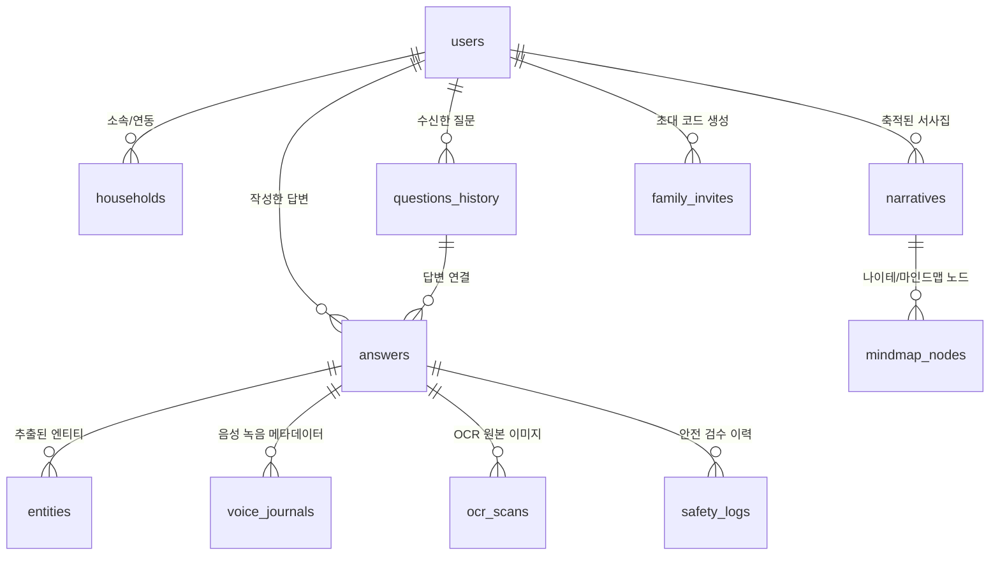

# 📐 이음 (EEUM) 플랫폼 데이터베이스 구조 명세서

본 문서는 이음(EEUM) 세대 간 연결 회상 플랫폼의 **전체 데이터베이스 스키마 구조**를 정의합니다.  
현재 연동되어 작동 중인 테이블 7종과, 향후 서비스 고도화(Tier 2~3) 시 구축할 확장 테이블 5종을 포함하고 있습니다.

---

## 🎨 ERD (Entity Relationship Diagram)



---

## 1. 🟢 현재 완성 및 적용된 데이터베이스 테이블 (7종)

### 1) `users` (사용자 및 계정 정보)
| 컬럼명 | 타입 | 제약 조건 | 설명 |
| :--- | :--- | :--- | :--- |
| `id` | `TEXT / UUID` | PRIMARY KEY | 사용자 고유 ID |
| `role` | `TEXT` | NOT NULL | 역할 (`self`: 어르신 본인, `guardian`: 보호자) |
| `paired_user_id` | `TEXT` | NULLABLE | 연동된 상대방 사용자 ID |
| `name` | `TEXT` | NOT NULL | 성함 또는 닉네임 |
| `email` | `TEXT` | UNIQUE | 이메일 주소 |
| `dob` | `TEXT` | NULLABLE | 생년월일 (어르신 본인) |
| `phone` | `TEXT` | NULLABLE | 전화번호 |
| `user_code` | `TEXT` | UNIQUE | 가족 연동용 6자리 식별 코드 |
| `text_size` | `TEXT` | DEFAULT 'medium' | 접근성 폰트 크기 |
| `created_at` | `TIMESTAMPTZ` | DEFAULT NOW() | 가입 일시 |

### 2) `households` (가족 연동 맵)
| 컬럼명 | 타입 | 제약 조건 | 설명 |
| :--- | :--- | :--- | :--- |
| `id` | `TEXT / UUID` | PRIMARY KEY | 가구(가족) 고유 ID |
| `elderly_id` | `TEXT` | NOT NULL | 어르신 사용자 ID |
| `guardian_id` | `TEXT` | NOT NULL | 보호자 사용자 ID |
| `relationship` | `TEXT` | NOT NULL | 관계 (예: "딸", "아들", "손주") |
| `created_at` | `TIMESTAMPTZ` | DEFAULT NOW() | 연동 성립 일시 |

### 3) `questions_history` (회상 질문 이력)
| 컬럼명 | 타입 | 제약 조건 | 설명 |
| :--- | :--- | :--- | :--- |
| `id` | `TEXT / UUID` | PRIMARY KEY | 질문 고유 ID |
| `user_id` | `TEXT` | NOT NULL | 수신자 사용자 ID |
| `question_text` | `TEXT` | NOT NULL | 회상 질문 내용 |
| `memory_zone` | `TEXT` | DEFAULT 'sharedIndependentMemory' | `sharedIndependentMemory`, `inheritedStory`, `soloPatientOnly` |
| `shared` | `BOOLEAN` | DEFAULT TRUE | 자녀와 공통 공유 질문 여부 |
| `status` | `TEXT` | DEFAULT 'pending' | `pending`(대기), `answered`(답변완료) |
| `created_at` | `TIMESTAMPTZ` | DEFAULT NOW() | 질문 생성 일시 |

### 4) `answers` (어르신 및 보호자의 회상 답변)
| 컬럼명 | 타입 | 제약 조건 | 설명 |
| :--- | :--- | :--- | :--- |
| `id` | `TEXT / UUID` | PRIMARY KEY | 답변 고유 ID |
| `user_id` | `TEXT` | NOT NULL | 답변 작성자 사용자 ID |
| `question_id` | `TEXT` | NOT NULL | 관련 질문 ID |
| `question_text` | `TEXT` | NOT NULL | 스냅샷 질문 문구 |
| `answer_text` | `TEXT` | NOT NULL | 안전검수 완료된 최종 답변 텍스트 |
| `event_date` | `TEXT` | NOT NULL | 사건/기억 발생 시기 (예: "1972-10-15") |
| `memory_zone` | `TEXT` | NULLABLE | 회상 구간 영역 |
| `by_guardian` | `BOOLEAN` | DEFAULT FALSE | 보호자 대리 기록 여부 (출처 태깅) |
| `is_private` | `BOOLEAN` | DEFAULT FALSE | 개별 비공개 수락 여부 |
| `created_at` | `TIMESTAMPTZ` | DEFAULT NOW() | 기록 일시 |

### 5) `entities` (Agent 1 추출 11종 엔티티 데이터)
| 컬럼명 | 타입 | 제약 조건 | 설명 |
| :--- | :--- | :--- | :--- |
| `id` | `TEXT / UUID` | PRIMARY KEY | 엔티티 고유 ID |
| `answer_id` | `TEXT` | NOT NULL | 원본 답변 ID |
| `user_id` | `TEXT` | NOT NULL | 사용자 ID |
| `category` | `TEXT` | NOT NULL | 11종 분류 (`person`, `location`, `date`, `event`, `object`, `food`, `sensory`, `animal`, `emotion` 등) |
| `name` | `TEXT` | NOT NULL | 추출된 단어/명사 |
| `context` | `TEXT` | NULLABLE | 문맥 파라미터 |
| `created_at` | `TIMESTAMPTZ` | DEFAULT NOW() | 추출 일시 |

### 6) `narratives` (Agent 3 재구성 서사집 챕터)
| 컬럼명 | 타입 | 제약 조건 | 설명 |
| :--- | :--- | :--- | :--- |
| `id` | `TEXT / UUID` | PRIMARY KEY | 서사 챕터 ID |
| `user_id` | `TEXT` | NOT NULL | 대상 어르신 사용자 ID |
| `title` | `TEXT` | NOT NULL | 챕터 제목 (10자 이내) |
| `summary` | `TEXT` | NOT NULL | 요약 문단 (나이테/마인드맵 노드용) |
| `content` | `TEXT` | NOT NULL | 2~3문장의 수필 형태 서사 텍스트 |
| `chapter_tag` | `TEXT` | DEFAULT 'shared' | `shared`(세대 연결), `inherited`(전해들은 이야기), `solo_hidden_gem`(자녀가 모르는 이야기) |
| `event_date` | `TEXT` | NOT NULL | 연대기 정열용 사건 일자 |
| `merged_answers` | `JSONB` | NULLABLE | 부모-자녀 병기 응답 배열 JSON |
| `created_at` | `TIMESTAMPTZ` | DEFAULT NOW() | 생성 일시 |

### 7) `mindmap_nodes` (나이테/마인드맵 시각화 데이터)
| 컬럼명 | 타입 | 제약 조건 | 설명 |
| :--- | :--- | :--- | :--- |
| `id` | `TEXT / UUID` | PRIMARY KEY | 마인드맵 노드 ID |
| `user_id` | `TEXT` | NOT NULL | 어르신 사용자 ID |
| `narrative_id` | `TEXT` | NULLABLE | 관련 서사 챕터 ID |
| `label` | `TEXT` | NOT NULL | 노드에 표시될 명사/사건 이름 |
| `node_size` | `INTEGER` | DEFAULT 65 | 나이테 내 노드 반지름 크기 (60px ~ 140px) |
| `signal_score` | `REAL` | DEFAULT 0.0 | 언급 빈도 및 탐구 지수 |
| `created_at` | `TIMESTAMPTZ` | DEFAULT NOW() | 생성 일시 |

---

## 2. 🟡 향후 고도화를 위해 추가할 확장 테이블 (5종)

### 8) `voice_journals` (음성 저널링 오디오 메타데이터) — *Tier 2*
> **목적**: 어르신의 실제 음성 원본 오디오 파일과 Web Speech API / STT 변환 텍스트 보관.

| 컬럼명 | 타입 | 제약 조건 | 설명 |
| :--- | :--- | :--- | :--- |
| `id` | `TEXT / UUID` | PRIMARY KEY | 음성 이력 ID |
| `answer_id` | `TEXT` | NOT NULL | 관련 답변 ID |
| `audio_url` | `TEXT` | NOT NULL | Supabase Storage 내 `.wav/.mp3` 경로 |
| `duration_seconds` | `INTEGER` | NOT NULL | 녹음 시간(초) |
| `stt_transcript` | `TEXT` | NOT NULL | STT 자동 변환 텍스트 |
| `created_at` | `TIMESTAMPTZ` | DEFAULT NOW() | 녹음 일시 |

### 9) `ocr_scans` (Upstage OCR 스캔본 원본 & 정정 이력) — *Tier 1 확장*
> **목적**: 업로드한 일기장/편지 손글씨 원본 스캔본과 Agent 1의 판독 신뢰도(Confidence Score) 보관.

| 컬럼명 | 타입 | 제약 조건 | 설명 |
| :--- | :--- | :--- | :--- |
| `id` | `TEXT / UUID` | PRIMARY KEY | OCR 스캔 ID |
| `answer_id` | `TEXT` | NULLABLE | 연결된 답변 ID |
| `image_url` | `TEXT` | NOT NULL | Supabase Storage 이미지 경로 |
| `confidence_score` | `REAL` | NOT NULL | Upstage OCR 판독 신뢰도 (예: 0.95) |
| `needs_recapture` | `BOOLEAN` | DEFAULT FALSE | 재촬영 요청 여부 (신뢰도 저하 시) |
| `raw_text` | `TEXT` | NOT NULL | Upstage Document Parse 추출 원문 |
| `user_corrected_text`| `TEXT` | NULLABLE | 어르신/보호자가 2단계로 직접 정정한 텍스트 |
| `created_at` | `TIMESTAMPTZ` | DEFAULT NOW() | 업로드 일시 |

### 10) `family_invites` (가족 연동 초대 코드 발급/관리) — *Tier 2*
> **목적**: 어르신과 자녀를 안전하게 연결하기 위한 6자리 핀코드 생성 및 만료 시간 관리.

| 컬럼명 | 타입 | 제약 조건 | 설명 |
| :--- | :--- | :--- | :--- |
| `id` | `TEXT / UUID` | PRIMARY KEY | 초대 ID |
| `creator_id` | `TEXT` | NOT NULL | 발급자 사용자 ID |
| `invite_code` | `TEXT` | UNIQUE | 6자리 영문/숫자 연동 코드 |
| `status` | `TEXT` | DEFAULT 'active' | `active`(유효), `used`(사용됨), `expired`(만료) |
| `expires_at` | `TIMESTAMPTZ` | NOT NULL | 발급 후 24시간 만료 시각 |

### 11) `safety_logs` (Safety Guard 에이전트 차단/보정 이력) — *안전성 검증용*
> **목적**: Agent 4가 차단한 위험 표현(의료 진단, 처방, 평가적 지표)의 감지 이력 및 안전 우회 문장 보정 로그.

| 컬럼명 | 타입 | 제약 조건 | 설명 |
| :--- | :--- | :--- | :--- |
| `id` | `TEXT / UUID` | PRIMARY KEY | 로그 ID |
| `source_agent` | `TEXT` | NOT NULL | 차단 원인 에이전트 (`Agent 2` 또는 `Agent 3`) |
| `original_input` | `TEXT` | NOT NULL | 차단된 원본 위험 문장 |
| `violations` | `JSONB` | NOT NULL | 위반 항목 사유 (예: `["의료 진단성 표현"]`) |
| `fallback_text` | `TEXT` | NOT NULL | 안전 보정되어 대체된 우회 문장 |
| `created_at` | `TIMESTAMPTZ` | DEFAULT NOW() | 검수 일시 |

### 12) `notifications` (PWA 푸시 및 질문 발송 알림) — *Tier 2*
> **목적**: 매일 새로운 회상 질문이 도착했거나, 자녀가 추억을 연동했을 때 발송되는 알림 이력.

| 컬럼명 | 타입 | 제약 조건 | 설명 |
| :--- | :--- | :--- | :--- |
| `id` | `TEXT / UUID` | PRIMARY KEY | 알림 ID |
| `user_id` | `TEXT` | NOT NULL | 수신 사용자 ID |
| `type` | `TEXT` | NOT NULL | `daily_question`, `guardian_response`, `narrative_ready` |
| `title` | `TEXT` | NOT NULL | 알림 제목 |
| `body` | `TEXT` | NOT NULL | 알림 본문 |
| `read` | `BOOLEAN` | DEFAULT FALSE | 읽음 여부 |
| `created_at` | `TIMESTAMPTZ` | DEFAULT NOW() | 발송 일시 |

---

## 3. 🛠️ Supabase SQL DDL 실행 스크립트

Supabase SQL Editor에서 실행할 수 있는 전체 DDL 스크립트입니다:

```sql
-- 1. users
CREATE TABLE IF NOT EXISTS public.users (
  id TEXT PRIMARY KEY,
  role TEXT NOT NULL CHECK (role IN ('self', 'guardian')),
  paired_user_id TEXT,
  name TEXT NOT NULL,
  email TEXT UNIQUE,
  dob TEXT,
  phone TEXT,
  user_code TEXT UNIQUE,
  text_size TEXT DEFAULT 'medium',
  created_at TIMESTAMPTZ DEFAULT NOW()
);

-- 2. households
CREATE TABLE IF NOT EXISTS public.households (
  id TEXT PRIMARY KEY,
  elderly_id TEXT NOT NULL,
  guardian_id TEXT NOT NULL,
  relationship TEXT NOT NULL,
  created_at TIMESTAMPTZ DEFAULT NOW()
);

-- 3. questions_history
CREATE TABLE IF NOT EXISTS public.questions_history (
  id TEXT PRIMARY KEY,
  user_id TEXT NOT NULL,
  question_text TEXT NOT NULL,
  memory_zone TEXT DEFAULT 'sharedIndependentMemory',
  shared BOOLEAN DEFAULT TRUE,
  status TEXT DEFAULT 'pending' CHECK (status IN ('pending', 'answered')),
  created_at TIMESTAMPTZ DEFAULT NOW()
);

-- 4. answers
CREATE TABLE IF NOT EXISTS public.answers (
  id TEXT PRIMARY KEY,
  user_id TEXT NOT NULL,
  question_id TEXT NOT NULL,
  question_text TEXT NOT NULL,
  answer_text TEXT NOT NULL,
  event_date TEXT NOT NULL,
  memory_zone TEXT,
  by_guardian BOOLEAN DEFAULT FALSE,
  is_private BOOLEAN DEFAULT FALSE,
  created_at TIMESTAMPTZ DEFAULT NOW()
);

-- 5. entities
CREATE TABLE IF NOT EXISTS public.entities (
  id TEXT PRIMARY KEY,
  answer_id TEXT NOT NULL,
  user_id TEXT NOT NULL,
  category TEXT NOT NULL,
  name TEXT NOT NULL,
  context TEXT,
  created_at TIMESTAMPTZ DEFAULT NOW()
);

-- 6. narratives
CREATE TABLE IF NOT EXISTS public.narratives (
  id TEXT PRIMARY KEY,
  user_id TEXT NOT NULL,
  title TEXT NOT NULL,
  summary TEXT NOT NULL,
  content TEXT NOT NULL,
  chapter_tag TEXT DEFAULT 'shared',
  event_date TEXT NOT NULL,
  merged_answers JSONB,
  created_at TIMESTAMPTZ DEFAULT NOW()
);

-- 7. mindmap_nodes
CREATE TABLE IF NOT EXISTS public.mindmap_nodes (
  id TEXT PRIMARY KEY,
  user_id TEXT NOT NULL,
  narrative_id TEXT,
  label TEXT NOT NULL,
  node_size INTEGER DEFAULT 65,
  signal_score REAL DEFAULT 0.0,
  created_at TIMESTAMPTZ DEFAULT NOW()
);

-- 8. voice_journals
CREATE TABLE IF NOT EXISTS public.voice_journals (
  id TEXT PRIMARY KEY,
  answer_id TEXT NOT NULL,
  audio_url TEXT NOT NULL,
  duration_seconds INTEGER NOT NULL,
  stt_transcript TEXT NOT NULL,
  created_at TIMESTAMPTZ DEFAULT NOW()
);

-- 9. ocr_scans
CREATE TABLE IF NOT EXISTS public.ocr_scans (
  id TEXT PRIMARY KEY,
  answer_id TEXT,
  image_url TEXT NOT NULL,
  confidence_score REAL NOT NULL,
  needs_recapture BOOLEAN DEFAULT FALSE,
  raw_text TEXT NOT NULL,
  user_corrected_text TEXT,
  created_at TIMESTAMPTZ DEFAULT NOW()
);

-- 10. family_invites
CREATE TABLE IF NOT EXISTS public.family_invites (
  id TEXT PRIMARY KEY,
  creator_id TEXT NOT NULL,
  invite_code TEXT UNIQUE NOT NULL,
  status TEXT DEFAULT 'active',
  expires_at TIMESTAMPTZ NOT NULL
);

-- 11. safety_logs
CREATE TABLE IF NOT EXISTS public.safety_logs (
  id TEXT PRIMARY KEY,
  source_agent TEXT NOT NULL,
  original_input TEXT NOT NULL,
  violations JSONB NOT NULL,
  fallback_text TEXT NOT NULL,
  created_at TIMESTAMPTZ DEFAULT NOW()
);

-- 12. notifications
CREATE TABLE IF NOT EXISTS public.notifications (
  id TEXT PRIMARY KEY,
  user_id TEXT NOT NULL,
  type TEXT NOT NULL,
  title TEXT NOT NULL,
  body TEXT NOT NULL,
  read BOOLEAN DEFAULT FALSE,
  created_at TIMESTAMPTZ DEFAULT NOW()
);
```
